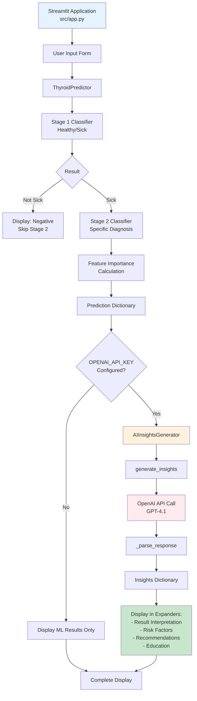
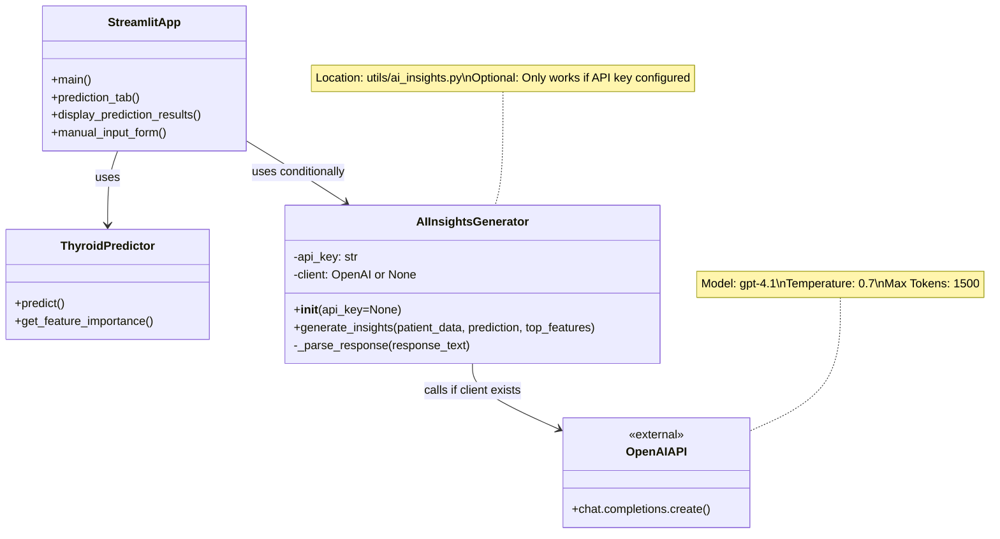
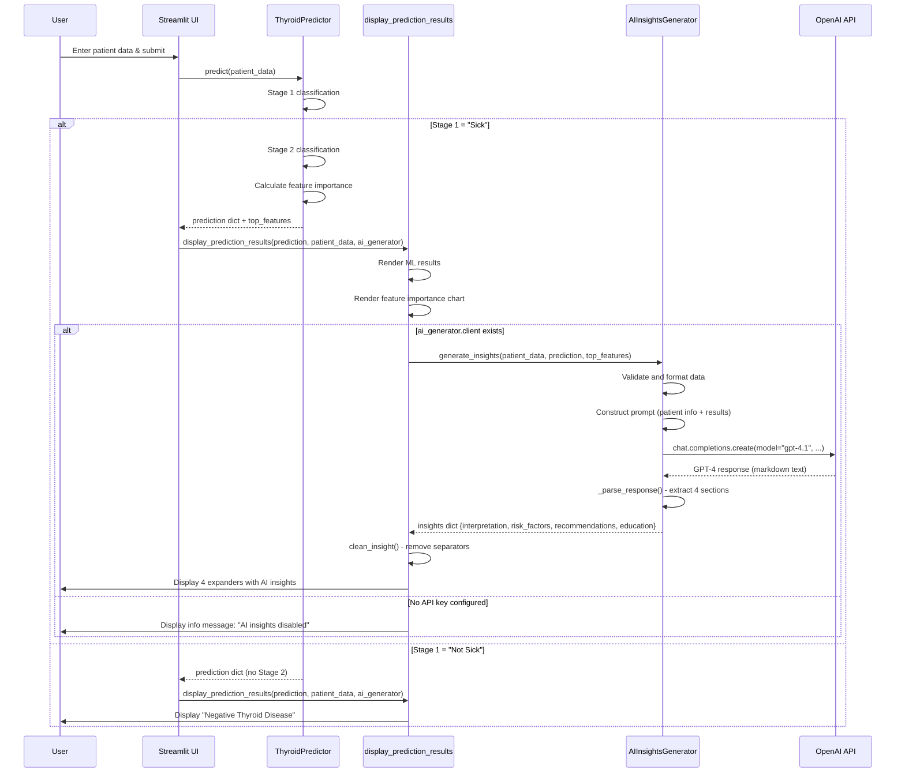
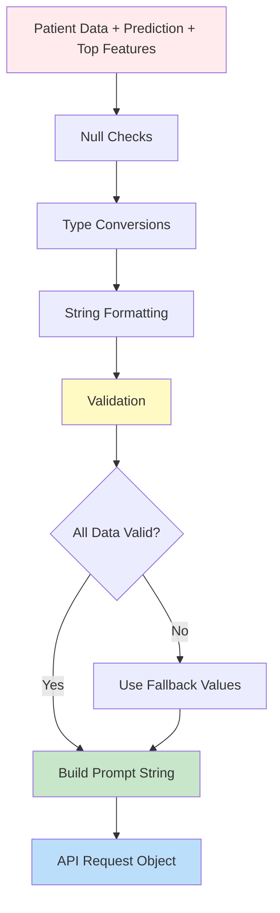
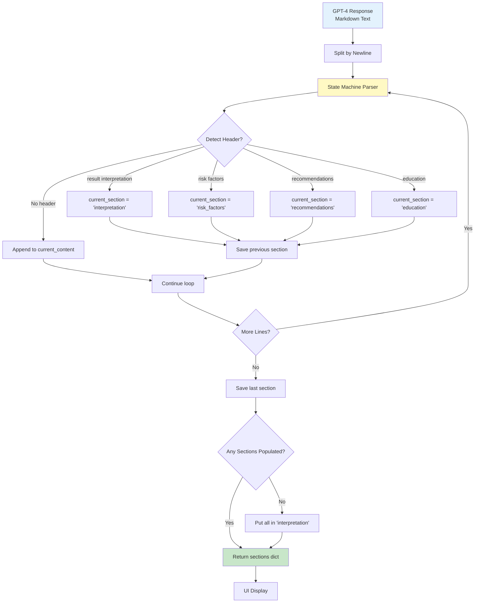
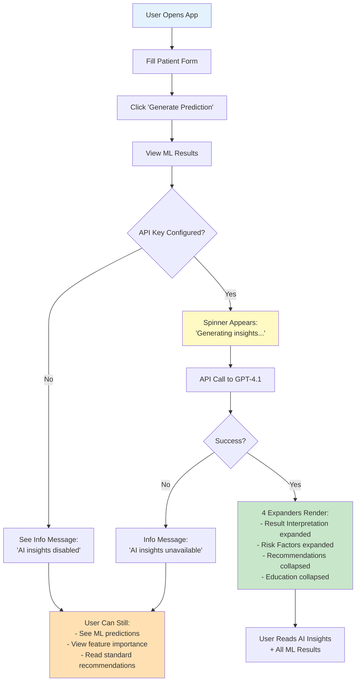
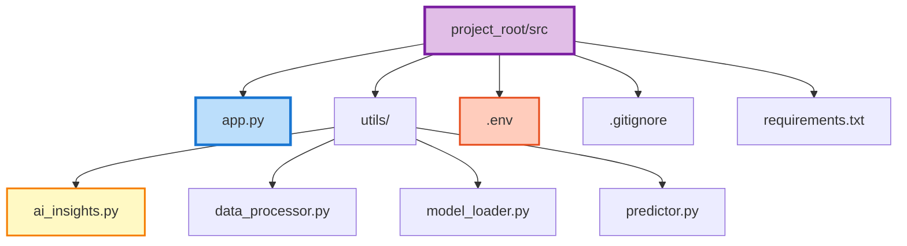

# Thyroid Disease Likelihood Project
## Generative AI Integration Documentation

## Overview

This project integrates OpenAI's GPT-4.1 model as an optional enhancement to a hierarchical machine learning system for thyroid disease classification. The Generative AI component provides personalized, human-readable interpretations of complex medical classification results, making the system more accessible to both healthcare professionals and patients.

**Key Integration Points:**
- **Model:** OpenAI GPT-4.1 (accessed via OpenAI Python client)
- **Primary Function:** Natural language explanation of ML predictions
- **Implementation:** Optional feature activated when `OPENAI_API_KEY` is configured in `.env` file
- **Architecture:** Standalone `AIInsightsGenerator` class in `src/utils/ai_insights.py`
- **Integration Point:** Called in `display_prediction_results()` function in `src/app.py`
- **Output:** Four structured sections (interpretation, risk_factors, recommendations, education)


## Purpose

### Why Generative AI?

The hierarchical machine learning models produce accurate classifications but generate technical outputs that may be difficult for non-experts to interpret:

- **Problem:** ML outputs like "Stage 1: Sick (92.3% confidence), Stage 2: G - Compensated Hypothyroid (85.1% confidence)" are accurate but lack context
- **Solution:** GPT-4.1 translates these technical results into four types of actionable, compassionate insights
- **Value Add:** Bridges the gap between ML predictions and patient understanding without replacing medical advice

### Use Case Justification

Generative AI was chosen specifically for:

1. **Result Interpretation:** Explaining classification results and diagnosis codes in plain language
2. **Risk Factor Analysis:** Identifying which lab values and features influenced the classification
3. **Practical Recommendations:** Providing actionable next steps with emphasis on consulting healthcare professionals
4. **Health Education:** Offering brief educational information about thyroid health relevant to the results


## Technical Architecture

### System Overview



### Component Architecture



---

## Implementation Details

### 1. Class Structure

**File:** `src/utils/ai_insights.py`

The `AIInsightsGenerator` class has three main components:

#### Initialization (`__init__`)

```python
def __init__(self, api_key=None):
    self.api_key = api_key or os.getenv('OPENAI_API_KEY')
    self.client = None
    
    if self.api_key:
        try:
            self.client = OpenAI(api_key=self.api_key)
        except Exception as e:
            print(f"Error initializing OpenAI client: {e}")
            self.client = None
```

**Design Decisions:**
- **Graceful Degradation:** If no API key is provided or initialization fails, `self.client` remains `None`
- **Environment Variable Priority:** Checks for `OPENAI_API_KEY` in environment (loaded from `.env` via `python-dotenv`)
- **Error Handling:** Catches initialization errors without crashing the application

#### Main Method (`generate_insights`)

```python
def generate_insights(self, patient_data, prediction, top_features):
    if not self.client:
        return {
            'error': True,
            'interpretation': 'OpenAI API key not configured.'
        }
    
    try:
        # Data extraction and validation (lines 49-92)
        # Prompt construction (lines 94-123)
        # API call (lines 125-140)
        # Response parsing (line 146)
        return insights
    except Exception as e:
        return {
            'error': True,
            'interpretation': f'Unable to generate insights at this time.'
        }
```

**Key Features:**
- Early return if client not initialized (prevents API call without credentials)
- Comprehensive error handling with try-except
- Returns error dictionary on failure (doesn't crash the app)

#### Response Parser (`_parse_response`)

```python
def _parse_response(self, response_text):
    sections = {
        'interpretation': '',
        'risk_factors': '',
        'recommendations': '',
        'education': ''
    }
    
    # Line-by-line parsing with keyword detection (lines 179-225)
    # State machine tracks current section
    # Returns dictionary with four sections
```

**Parsing Strategy:**
- Detects section headers using keyword matching
- Uses state machine to track current section
- Accumulates content line-by-line
- Falls back to putting everything in 'interpretation' if parsing fails

### 2. Data Preparation and Validation

The code implements extensive data validation before sending to GPT-4.1:

**Patient Data Processing:**
```python
# Age
age = str(patient_data.get('age') or 'Unknown')

# Sex conversion
sex_val = patient_data.get('sex')
sex = 'Female' if sex_val == 1 else 'Male' if sex_val == 0 else 'Unknown'

# Lab values with null handling
tsh = patient_data.get('TSH')
tsh_str = f"{float(tsh):.2f}" if tsh is not None else 'Not measured'
```

**Prediction Data Processing:**
```python
# Stage predictions
stage1 = str(prediction.get('stage1_prediction') or 'Unknown')
stage2 = str(prediction.get('stage2_prediction') or 'Not classified')

# Confidence values
confidence1_raw = prediction.get('stage1_confidence')
confidence1 = f"{float(confidence1_raw):.1%}" if confidence1_raw is not None else "Not available"

# Risk and diagnosis
risk_level = str(prediction.get('risk_level') or 'Unknown')
final_diagnosis = str(prediction.get('final_diagnosis') or 'Unknown')
```

**Feature Importance Processing:**
```python
feature_list = []
if top_features and len(top_features) > 0:
    for item in top_features[:5]:  # Only top 5 features
        try:
            if isinstance(item, (list, tuple)) and len(item) >= 2:
                feat, importance = item[0], item[1]
                if feat is not None and importance is not None:
                    feat_str = str(feat).upper()
                    imp_str = f"{float(importance):.3f}"
                    feature_list.append(f"- {feat_str}: {imp_str}")
        except (ValueError, TypeError, IndexError):
            continue

features_str = "\n".join(feature_list) if feature_list else "No feature importance data available"
```

**Validation Strategy:**
- Null-safe: All values checked before conversion
- Type-safe: Defensive type conversion with fallbacks
- Format-consistent: Percentages formatted as `.1%`, decimals as `.2f` or `.3f`
- Graceful: Missing data labeled explicitly ("Not measured", "Unknown")

---

## AI Functionality and Features

### 1. Prompt Construction

The system builds a structured prompt containing:

#### Patient Information
- **Age:** Extracted from patient_data
- **Sex:** Binary value (0/1) converted to "Male"/"Female"
- **Lab Values with Normal Ranges:**
  - TSH: mIU/L (Normal: 0.4-4.0)
  - T3: nmol/L (Normal: 0.8-2.0)
  - TT4: nmol/L (Normal: 60-150)

#### Classification Results
- **Stage 1:** Initial screening result (Healthy/Sick) with confidence percentage
- **Stage 2:** Specific diagnosis code with confidence percentage
- **Final Diagnosis:** Diagnosis code (A-T or combinations)
- **Risk Level:** Low/Medium/High assessment

#### Feature Importance
- **Top 5 Features:** Most influential features from model
- **Importance Scores:** Float values (0-1 scale) formatted to 3 decimal places

### 2. Complete Prompt Template

```python
prompt = f"""You are a medical AI assistant helping to explain thyroid disease screening results. 
Provide clear, compassionate, and accurate insights based on this patient's data.

Patient Information:
- Age: {age} years
- Sex: {sex}
- TSH: {tsh_str} mIU/L (Normal: 0.4-4.0)
- T3: {t3_str} nmol/L (Normal: 0.8-2.0)
- TT4: {tt4_str} nmol/L (Normal: 60-150)

Classification Results:
- Stage 1 (Initial Screening): {stage1}
- Stage 1 Confidence: {confidence1}
- Stage 2 Classification: {stage2}
- Stage 2 Confidence: {confidence2}
- Final Diagnosis: {final_diagnosis}
- Risk Level: {risk_level}

Top Contributing Features:
{features_str}

Please provide insights in all of these areas:

RESULT INTERPRETATION: Explain what these results mean or the overview of the results to a patient. If the patient is positive with thyroid disease, explain the diagnosis classification.
RISK FACTORS: Identify the key factors that influenced this classification.
RECOMMENDATIONS: Suggest practical next steps (emphasize consulting healthcare professionals).
EDUCATION: Provide brief educational information about thyroid health relevant to these results.

Format your response with clear section headers and use markdown formatting."""
```

### 3. System Prompt

```python
{
    "role": "system",
    "content": "You are a helpful medical AI assistant specializing in thyroid health. Provide clear, accurate, and compassionate explanations. Always emphasize that these are screening results and not a diagnosis, and that patients should consult healthcare professionals."
}
```

**Key Elements:**
- **Role Definition:** Medical AI assistant specializing in thyroid health
- **Tone Guidance:** Clear, accurate, and compassionate
- **Safety Emphasis:** Screening vs. diagnosis distinction
- **Professional Referral:** Always recommend consulting healthcare professionals

### 4. API Configuration

```python
response = self.client.chat.completions.create(
    model="gpt-4.1",
    messages=[
        {"role": "system", "content": "..."},
        {"role": "user", "content": prompt}
    ],
    temperature=0.7,
    max_tokens=1500
)
```

**Parameter Justification:**
- **model:** `"gpt-4.1"` - Latest GPT-4 model with medical reasoning capabilities
- **temperature:** `0.7` - Balances creativity (natural language) with consistency (factual accuracy)
- **max_tokens:** `1500` - Allows comprehensive 4-section response (~800-1200 tokens typical output)

---

## Data Flow and Processing

### Complete Data Flow Sequence



### Input Processing Pipeline



### Output Processing Pipeline



---

## Prompt Engineering Strategy

### Prompt Structure Overview

```mermaid
graph TB
    A[Complete Prompt] --> B[System Message]
    A --> C[User Message]
    
    B --> B1["Role: Medical AI Assistant<br/>Specialty: Thyroid Health"]
    B --> B2["Tone: Clear, Accurate, Compassionate"]
    B --> B3["Safety: Screening vs Diagnosis"]
    B --> B4["Referral: Consult Professionals"]
    
    C --> D[Patient Information Block]
    C --> E[Classification Results Block]
    C --> F[Feature Importance Block]
    C --> G[Output Instructions Block]
    
    D --> D1["Age: {age} years"]
    D --> D2["Sex: {sex}"]
    D --> D3["TSH: {tsh_str} mIU/L<br/>Normal: 0.4-4.0"]
    D --> D4["T3: {t3_str} nmol/L<br/>Normal: 0.8-2.0"]
    D --> D5["TT4: {tt4_str} nmol/L<br/>Normal: 60-150"]
    
    E --> E1["Stage 1: {stage1}<br/>Confidence: {confidence1}"]
    E --> E2["Stage 2: {stage2}<br/>Confidence: {confidence2}"]
    E --> E3["Final Diagnosis: {final_diagnosis}"]
    E --> E4["Risk Level: {risk_level}"]
    
    F --> F1["Top 5 Features with<br/>Importance Scores 0-1"]
    
    G --> G1["RESULT INTERPRETATION:<br/>Explain results to patient"]
    G --> G2["RISK FACTORS:<br/>Key influencing factors"]
    G --> G3["RECOMMENDATIONS:<br/>Practical next steps"]
    G --> G4["EDUCATION:<br/>Brief thyroid health info"]
    
    style A fill:#E1BEE7
    style B fill:#F8BBD0
    style C fill:#BBDEFB
    style D fill:#C5E1A5
    style E fill:#FFE082
    style F fill:#FFCCBC
    style G fill:#B2DFDB
```



### Design Principles

1. **Structured Sections:** Explicitly requests four distinct insight types using ALL CAPS headers
2. **Context-Rich:** Provides comprehensive patient data including normal ranges for interpretation
3. **Output Format:** Requests markdown formatting with clear section headers
4. **Safety First:** System prompt emphasizes "screening results and not a diagnosis"
5. **Tone Guidance:** Requests "clear, compassionate, and accurate" explanations

### Section-Specific Instructions

| Section | Goal | Audience | Content |
|---------|------|----------|---------|
| **Result Interpretation** | Explain classification in plain language | Patients or healthcare providers | Overview of findings, diagnosis code explanation |
| **Risk Factors** | Identify key contributing features | Clinically-minded users | Which lab values or features influenced the classification |
| **Recommendations** | Provide actionable next steps | Patients seeking guidance | Practical advice with emphasis on professional consultation |
| **Education** | Build health literacy | General public | Brief thyroid health information relevant to results |


### Configuration Security

```python
# ✅ SECURE: Environment variable
load_dotenv()
self.api_key = os.getenv('OPENAI_API_KEY')

# NOT USED: Hardcoded
# self.api_key = "sk-..."
```

## User Experience Integration

### Streamlit UI Integration

#### 1. Initialization in Session State

```python
# In app.py main()
if 'ai_generator' not in st.session_state:
    st.session_state.ai_generator = None

# During initialization
ai_generator = AIInsightsGenerator()
st.session_state.ai_generator = ai_generator
```

#### 2. Conditional Display Logic

```python
# In display_prediction_results() - line 715
if ai_generator and ai_generator.client:
    with st.spinner("🔄 Generating personalized insights..."):
        insights = ai_generator.generate_insights(
            patient_data,
            prediction,
            top_features
        )
    
    if 'error' not in insights or not insights.get('error'):
        # Display 4 expanders with insights
        with st.expander("📋 Result Interpretation", expanded=True):
            st.markdown(clean_insight(insights["interpretation"]))
        
        with st.expander("⚠️ Key Risk Factors", expanded=True):
            st.markdown(clean_insight(insights["risk_factors"]))
        
        with st.expander("💡 Recommendations", expanded=True):
            st.markdown(clean_insight(insights["recommendations"]))
        
        with st.expander("📚 Educational Information", expanded=True):
            st.markdown(clean_insight(insights["education"]))
    else:
        st.info("💡 AI insights unavailable. " + insights.get('interpretation', ''))
else:
    st.info("💡 AI insights are currently disabled. Add your OPENAI_API_KEY to the .env file...")
```

#### 3. Text Cleaning Function

```python
def clean_insight(text):
    """Remove trailing newlines and separators from insight text."""
    if text:
        if text.endswith('---'):
            text = text[:-3].rstrip()
            text = re.sub(r'^#+\s+', '', text, flags=re.MULTILINE)
        return text
    return text
```

**Purpose:** Removes markdown artifacts (separators, redundant headers) from GPT-4 output before display

### User Workflow



---

## Code Structure and Integration

### File Structure



### Integration Points

**1. Import Statement (app.py line 19):**
```python
from utils.ai_insights import AIInsightsGenerator
```

**2. Initialization (app.py line 318):**
```python
ai_generator = AIInsightsGenerator()
```

**3. Session State Storage (app.py line 345):**
```python
st.session_state.ai_generator = ai_generator
```

**4. Function Parameter (app.py line 396):**
```python
def prediction_tab(processor, predictor, ai_generator):
```

**5. Actual Usage (app.py line 715-749):**
```python
if ai_generator and ai_generator.client:
    insights = ai_generator.generate_insights(patient_data, prediction, top_features)
    # Display insights in expanders
```

### Key Dependencies

```
openai>=1.0.0          # OpenAI Python client
python-dotenv>=0.19.0  # Load .env file
streamlit>=1.12.0      # Web UI framework
pandas>=1.3.0          # Data manipulation
numpy>=1.21.0          # Numerical operations
plotly>=5.0.0          # Interactive charts
```

### Environment Configuration

```bash
# .env file (in project root)
OPENAI_API_KEY=sk-your-api-key-here
```

**Setup Instructions:**
1. Create `.env` file in project root directory
2. Add line: `OPENAI_API_KEY=your-actual-key`
3. Ensure `.env` is in `.gitignore`
4. Restart Streamlit application
5. AI insights will automatically be available

